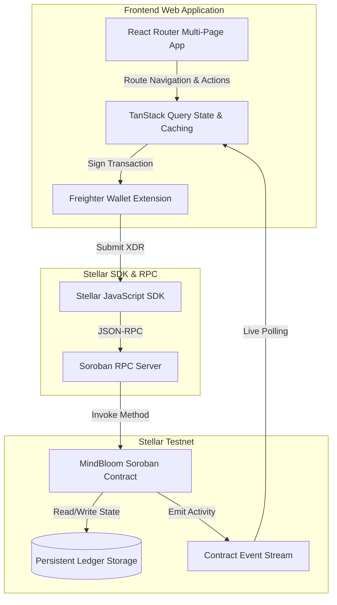

# MindBloom

<div align="center">

**An On-Chain Mindfulness Tracker and Calm Streak Protocol Built on Stellar Soroban**

*Auditable meditation journals, weekly wellness intentions, and trustless streak verification*

[](https://mindbloom-ledger.netlify.app/)
[](https://github.com/deepcloud2425/MindBloom)
[](https://stellar.expert/explorer/testnet)
[](https://www.risein.com/)

</div>

---

## Table of Contents

1. [Problem Statement](#problem-statement)
2. [Why Stellar?](#why-stellar)
3. [Live Deployment](#live-deployment)
4. [Contract Addresses & Transactions](#contract-addresses--transactions)
5. [User Onboarding & Feedback](#user-onboarding--feedback)
6. [Architecture](#architecture)
7. [Smart Contracts](#smart-contracts)
8. [Production Hardening (Level 4)](#production-hardening-level-4)
9. [Tech Stack](#tech-stack)
10. [Project Structure](#project-structure)
11. [Testing](#testing)
12. [CI/CD Pipeline](#cicd-pipeline)
13. [Local Development](#local-development)
14. [Roadmap](#roadmap)
15. [Author](#author)

---

## Problem Statement

Traditional wellness and mindfulness apps operate as closed, centralized silos. User meditation history, streak consistency, and personal wellness goals are locked within proprietary servers where platforms can alter streak algorithms, restrict data export, or monetize private behavioral patterns. When individuals invest months into cultivating daily mindfulness practices, they lack ownership of their consistency records.

Furthermore, corporate wellness programs and decentralized organizations seeking to reward mindfulness consistency have no trustless mechanism to verify self-reported wellness logs without invading personal privacy or relying on central servers.

**MindBloom** solves this by introducing a decentralized mindfulness journal powered by Stellar Soroban smart contracts. Users maintain full ownership of their wellness profiles, weekly intentions, and session logs on-chain. Calm streaks are mathematically calculated and verified by contract logic across daily boundaries, providing transparent, tamper-proof proof of consistency while keeping individual practice notes lightweight and auditable.

---

## Why Stellar?

MindBloom leverages Stellar and Soroban for several architectural advantages:

| Stellar Property | MindBloom Benefit |
|-----------------|-------------------|
| **Sub-Second Confirmation** | Logging a daily 20-minute meditation session commits instantly without waiting for slow blockchain consensus |
| **Negligible Fees** | Wellness tracking requires high-frequency micro-interactions (daily session logs). Soroban's low fee structure makes daily on-chain journaling economically viable |
| **Persistent Storage Model** | MindBloom utilizes Soroban's persistent storage hierarchy to maintain user profiles and session counters without risk of state expiration |
| **Auditable Event Emitting** | Every profile update, session log, and milestone achievement emits a structured Soroban contract event for live public activity feeds |

---

## Live Deployment

| Resource | Link |
|----------|------|
| **Live Web App** | [mindbloom-ledger.netlify.app](https://mindbloom-ledger.netlify.app/) |
| **GitHub Repo** | [deepcloud2425/MindBloom](https://github.com/deepcloud2425/MindBloom) |
| **Contract Explorer** | [View on Stellar Lab](https://lab.stellar.org/r/testnet/contract/CA65JTALTWIRVFHU5VM3M33EL5INJIPX6W3CDFAORR7EAWR6MUOWPRTN) |

---

## Contract Addresses & Transactions

All contracts are deployed and initialized on the **Stellar Testnet**.

### Deployed Contract IDs

| Contract | Address |
|----------|---------|
| **MindBloom Contract** | `CA65JTALTWIRVFHU5VM3M33EL5INJIPX6W3CDFAORR7EAWR6MUOWPRTN` |

---

## User Onboarding & Feedback

As part of the Level 4 production MVP requirements, we designed a seamless onboarding flow to introduce users to on-chain mindfulness tracking on the Stellar Testnet.

**Onboarding Journey:**

```
1. User installs Freighter Wallet and connects to Stellar Testnet
2. User navigates to the MindBloom Landing Page
3. User connects wallet and creates a Wellness Profile (setting a weekly goal)
4. User navigates to the Log Session page and records a meditation session
5. Smart contract validates the session and updates the user's Calm Streak
6. User reviews their progress on the Dashboard and Activity Feed
```

---

## Architecture

MindBloom separates state storage, business logic, and user presentation into a clean three-tier architecture:



---

## Smart Contracts

The core logic resides in `contracts/mind_bloom/src/lib.rs`. It manages user profiles, calculates streak progression across UTC day boundaries, and enforces weekly goal resets.

### Public Contract Methods

| Function | Access | Description |
|----------|--------|-------------|
| `save_profile()` | User | Registers or updates a user profile. Requires auth. Enforces goal bounds |
| `update_weekly_goal()` | User | Retunes weekly target without losing logged progress |
| `log_session()` | User | Logs a meditation session. Automatically increments calm streak if logged on consecutive days |
| `get_dashboard()` | Public (read) | Returns the aggregate WellnessProfile struct for UI dashboard rendering |
| `get_session_count()` | Public (read) | Returns the total number of sessions recorded by the wallet |
| `get_session()` | Public (read) | Retrieves a specific session snapshot by its 0-indexed position |
| `has_profile()` | Public (read) | Convenience helper checking whether an address has initialized a profile |

---

## Production Hardening (Level 4)

The following security and production improvements were implemented and tested in Level 4:

### Smart Contract Security

| Fix | Description |
|-----|-------------|
| Profile Validation | Enforces minimum character bounds on display names |
| Goal Bounds | Enforces reasonable minimum and maximum weekly goal limits |
| Session Validation | Blocks session entries under the 5-minute minimum threshold |
| Time Boundary Logic | Simulates ledger timestamp advancement across 7-day boundaries for automatic resets |
| Event Emissions | Structured Soroban contract events for all profile and session activities |

### Frontend Production Quality

| Fix | Description |
|-----|-------------|
| Multi-Page Architecture | Replaced monolithic App.jsx with clean React Router multi-page architecture |
| Professional UI Theme | Replaced AI-generated aesthetics with a professional warm cream palette and DM Sans typography |
| Static Routing Fallback | Added Netlify redirects for seamless SPA routing |
| Real-time Activity Feed | Public community event stream polling every 15 seconds |
| Client-Side Validations | Robust address truncation, duration formatting, and error parsing utilities |

---

## Tech Stack

| Layer | Technology | Purpose |
|-------|-----------|---------|
| **Frontend Framework** | React + Vite | Fast compilation, modern component architecture |
| **Routing** | React Router DOM | Multi-page layout navigation |
| **Styling** | Vanilla CSS | Clean, custom professional aesthetics |
| **Smart Contracts** | Soroban (Rust) | On-chain mindfulness tracking logic |
| **Blockchain SDK** | @stellar/stellar-sdk | Transaction building, XDR encoding, RPC calls |
| **Wallet Integration** | @stellar/freighter-api | Freighter wallet connection |
| **State Management** | TanStack Query | Asynchronous contract data fetching and caching |
| **Frontend Testing** | Vitest | Unit and utility function tests |
| **Contract Testing** | Rust test framework | Contract logic simulation |
| **CI/CD** | GitHub Actions | Automated lint, test, and build pipeline |
| **Hosting** | Netlify | Frontend production deployment |

---

## Project Structure

```
MindBloom/
├── .github/
│   └── workflows/
│       └── ci-cd.yml                 # Automated tests and build on push/PR
├── contracts/
│   └── mind_bloom/
│       └── src/
│           ├── lib.rs                # Full mindfulness tracking contract
│           └── test.rs               # Soroban unit tests
├── frontend/
│   ├── public/
│   │   └── _redirects                # Netlify SPA routing rules
│   ├── src/
│   │   ├── __tests__/                # Vitest utility test suite
│   │   ├── components/               # Reusable React components (Layout)
│   │   ├── lib/                      # Stellar SDK and contract interaction wrappers
│   │   ├── pages/                    # React Router page components
│   │   ├── main.jsx                  # Application entry and routing setup
│   │   └── styles.css                # Global theme and styling
│   ├── package.json                  # Frontend dependencies and scripts
│   └── vite.config.js                # Vite and Vitest configuration
├── package.json                      # Workspace configuration and root scripts
└── netlify.toml                      # Netlify deployment configuration
```

---

## Testing

### Test Summary

| Suite | Tests | Status |
|-------|-------|--------|
| Frontend (Vitest) | 18 tests | All Passing |
| MindBloom Contract (Rust) | 8 tests | All Passing |
| **Total** | **26 tests** | **26/26 Passing** |

### Frontend Tests (Vitest)

```bash
npm run test:frontend
```
Covers address formatting, duration formatting, date strings, explorer links, and error parsing.

### Contract Tests (Rust)

```bash
cargo test --locked
```
Covers profile creation, validation failures, session logging, streak calculation across day boundaries, and milestone event emissions.

---

## CI/CD Pipeline

Triggered automatically on every push and pull request to `main`.

```
Push to main
     │
     ├── Set up Rust toolchain (wasm32v1-none)
     ├── Install Node.js & workspace dependencies
     ├── Run Soroban contract tests (cargo test)
     ├── Build contract wasm (cargo build)
     ├── Lint frontend (npm run lint)
     └── Build frontend bundle (npm run build:frontend)
```

Deployment to Netlify is configured automatically through GitHub integration upon successful `main` branch builds.

---

## Local Development

### Prerequisites

- **Node.js**: Version 18.0 or higher
- **Rust**: Stable toolchain with `wasm32v1-none` target
- **Stellar CLI**: Installed via `cargo install --locked stellar-cli`
- **Freighter Wallet**: Browser extension configured for Stellar Testnet

### Installation

```bash
# Clone the repository
git clone https://github.com/deepcloud2425/MindBloom.git
cd MindBloom

# Install workspace dependencies
npm install
```

### Running the Frontend

```bash
# Start development server
npm run dev
# -> http://localhost:5173
```

### Building & Deploying Contracts

```bash
# Run contract tests
npm run contract:test

# Build WASM binary
npm run contract:wasm

# Deploy to Stellar Testnet (ensure your deployer account is funded)
npm run contract:deploy

# Export configuration to frontend
npm run export:frontend
```

---

## Roadmap

### Level 3 (Complete)
- Soroban smart contract with streak logic and persistent storage
- React frontend with wallet connection
- Testnet deployment with on-chain transactions
- Rust contract unit tests and GitHub Actions CI pipeline

### Level 4 (Complete)
- Professional UI/UX refactor with multi-page navigation
- Frontend unit testing suite via Vitest
- Real-time on-chain Activity Feed
- Enhanced contract validations and boundary checks
- Seamless SPA deployment to Netlify

### Mainnet Launch (Planned)
- Third-party security audit of the Soroban contract
- Mainnet deployment
- Advanced analytics dashboard for detailed mindfulness insights
- Public launch and community onboarding

---

## Author

**Praveen Kumar** — [@deepcloud2425](https://github.com/deepcloud2425)

*Built for the [RiseIn Stellar dApp Development Program](https://www.risein.com/)*
